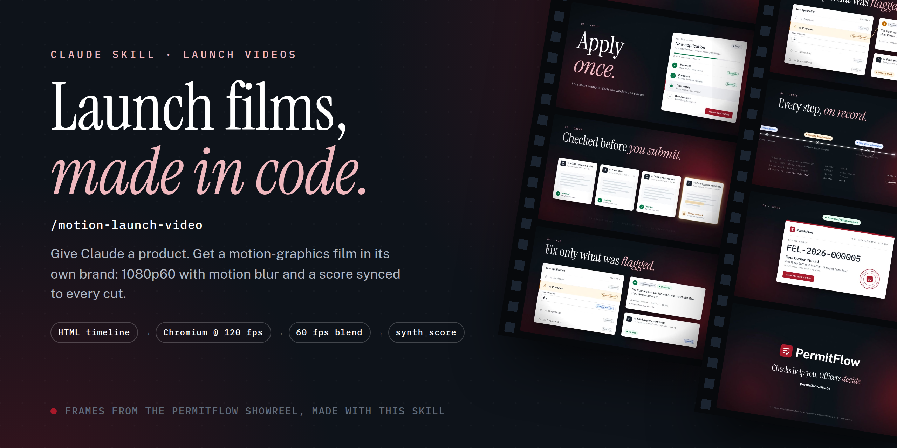

# motion-launch-video



A Claude skill that makes a motion-graphics launch video for any product, entirely in code, in the product's own brand.

The film is one HTML page whose every frame is a pure function of time. Headless Chromium renders it at 120 fps, pairs of frames are blended to 60 fps for real motion blur, and a score synthesised in Python puts every hit, tick and whoosh on the frame that causes it. Output: a 1920x1080 60 fps MP4 with sound, a poster frame and a 720p web copy.

It was extracted from the [PermitFlow](https://permitflow.space) showreel, which is included as a worked example. The frames in the picture above are from that film.

## Install

- **Claude (claude.ai, desktop, Cowork):** download `motion-launch-video.skill` from this repo and add it under Settings, Capabilities, Skills (or open it from a chat and click Save skill).
- **Claude Code (all projects):** `git clone <this repo> && cp -r motion-launch-video/motion-launch-video ~/.claude/skills/`
- **Claude Code (one project):** copy the `motion-launch-video/` folder into that project's `.claude/skills/`.

Then ask for it in plain words, for example "make a 20 second launch video for this app", or invoke `/motion-launch-video`.

## What is inside

| Path | What it is |
|---|---|
| `motion-launch-video/SKILL.md` | The workflow Claude follows: study the product, storyboard on a beat grid, build, review with contact sheets, score, render, deliver |
| `motion-launch-video/assets/film_template.html` | A runnable 10 s film: timeline engine, brand tokens, the mark building itself, a clipped diagonal wipe, a UI card scene, a zoom-through, an end card |
| `motion-launch-video/assets/score_template.py` | Its score, cue by cue |
| `motion-launch-video/scripts/` | `setup.sh` (ffmpeg, Chromium, playwright-core, numpy, scipy), `render.mjs` (stills and parallel 120 fps capture), `assemble.sh` (blend, mux, poster, web copy), `score_engine.py` (instruments and mix), `sheet.sh` and `sample.sh` (review) |
| `motion-launch-video/references/` | The motion playbook (storyboard grammar, transitions, moments, the bugs to check for), sound design notes, and the full PermitFlow film and score |
| `motion-launch-video.skill` | The same folder packaged for upload |

## Requirements

Node 18+, Python 3.10+, and either a system ffmpeg with libx264 or pip (the setup script installs `imageio-ffmpeg`). A Chromium or Chrome binary: Playwright's, a system Chrome, or `CHROME_PATH`.

## Run the template by hand

```bash
S=motion-launch-video; W=/tmp/film; mkdir -p $W
eval "$(bash $S/scripts/setup.sh $W)"
cp $S/assets/film_template.html $W/film.html; cp $S/assets/score_template.py $W/score.py
cd $W
node ../$S/scripts/render.mjs full film.html render 120 4   # adjust paths to where you cloned
SKILL_DIR=<path to motion-launch-video> python3 score.py
bash <path>/scripts/assemble.sh render score.wav template-film
```

## Reuse it

MIT licensed (see `LICENSE`): use it for your own launches or clients, fork it, change the templates, ship it inside your own skills or tools. Keep the licence notice with copies of the code.

Two things are not covered by this repo's licence and stay your responsibility in each film: the fonts (the template points at `fonts/*.woff2` that you supply; use the product's own files and check their licence allows embedding) and the product's brand (logo, name, copy). PermitFlow's name and mark in the worked example belong to that project; replace them in your own films.

Improvements are welcome as pull requests, especially new transitions and moments for `references/motion-playbook.md`, instruments for `scripts/score_engine.py`, and fixes found while making real films.
